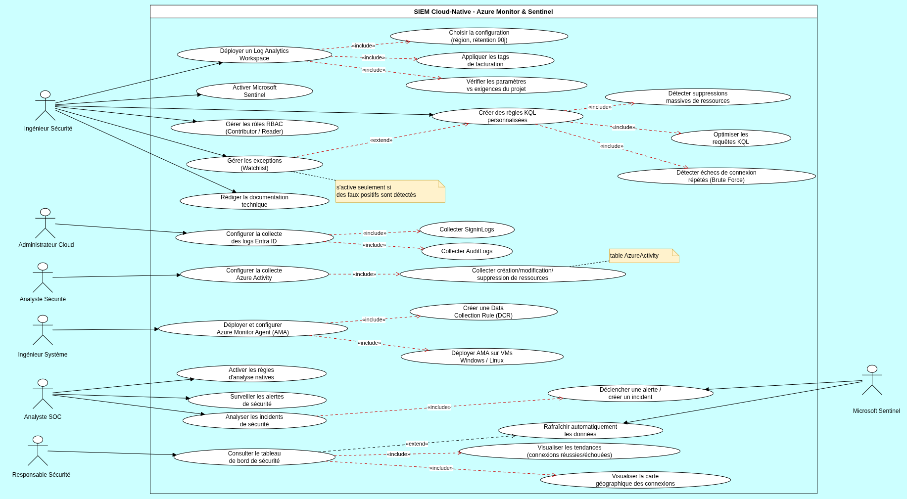
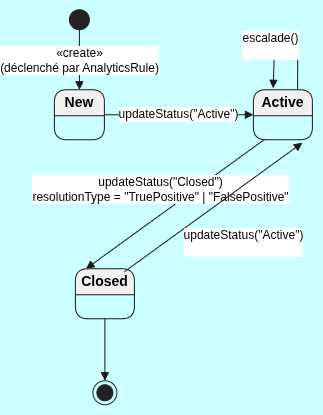
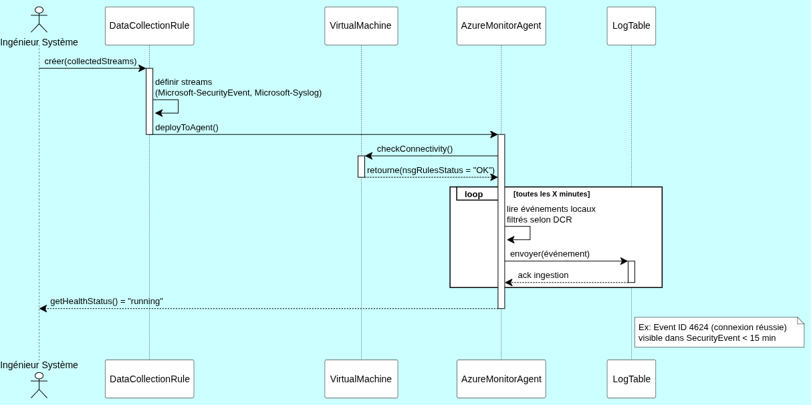
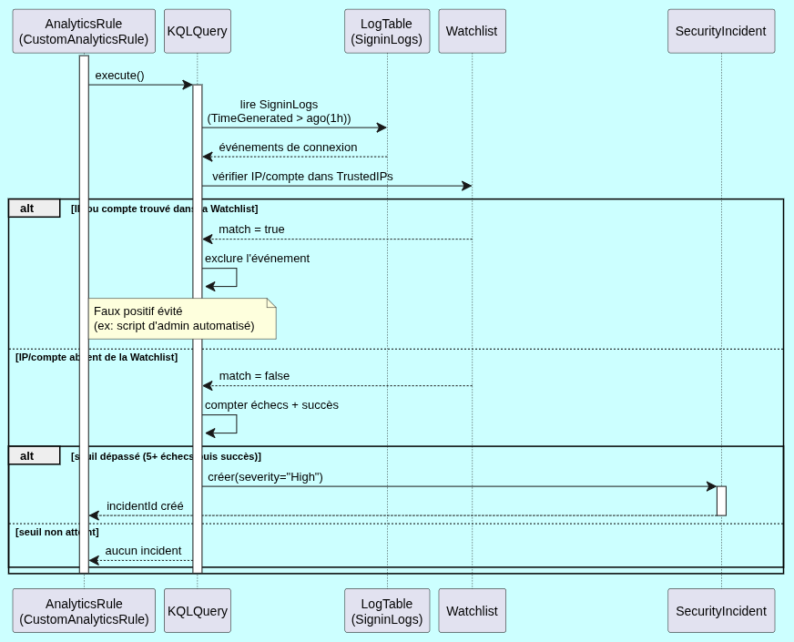
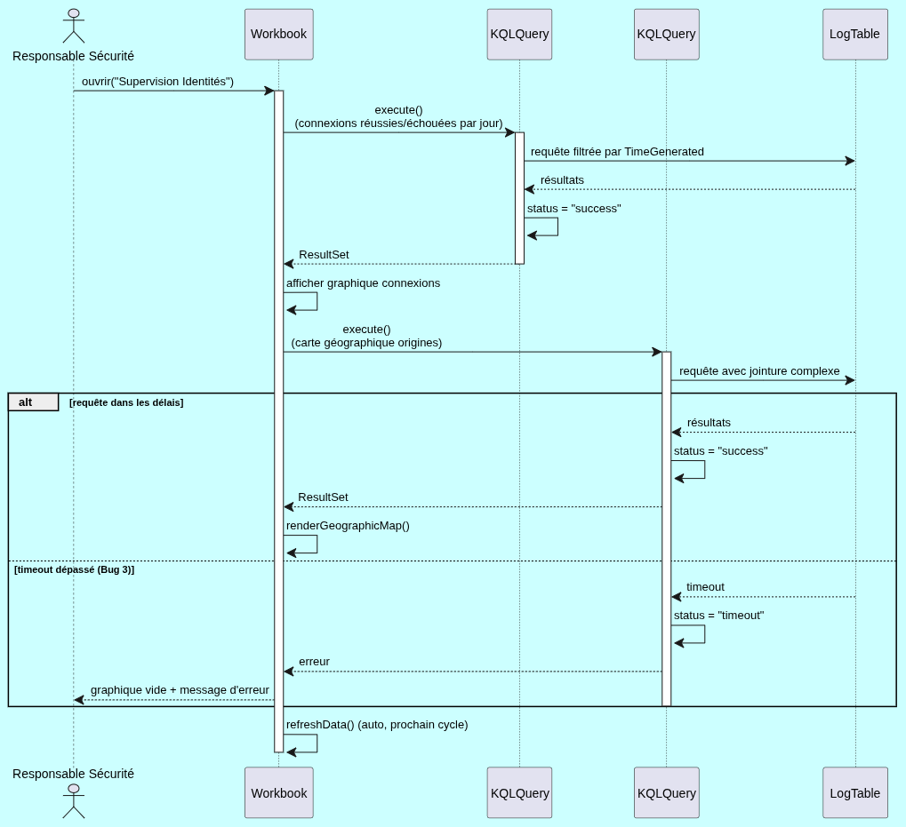
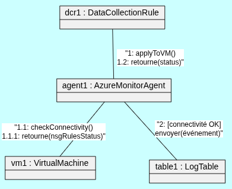
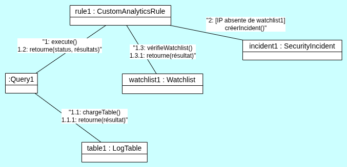
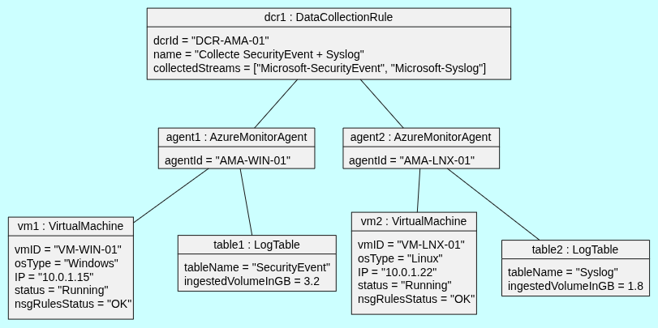
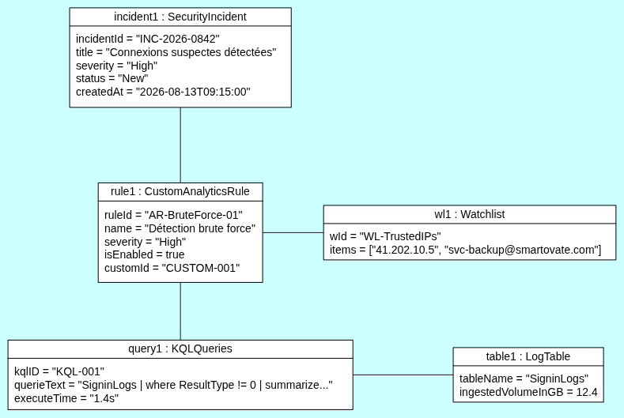
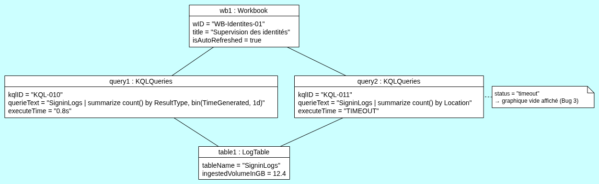

# SIEM Cloud-Native avec Azure Monitor et Microsoft Sentinel

**Document technique de stage — Smartovate**

> **Document de référence.** Son contenu est réparti dans des README spécialisés, à partir du [README principal](./README.md). Les fichiers sources cités plus bas ont été déplacés : `architecture.md` → `architecture/README.md`, `rbac.md` → `rbac/README.md`, `rule.md` → `detection/README.md`, `kql-guide.md` → `detection/kql-guide.md`, `workbook.md` → `workbooks/README.md`, `deployment-guide.md` → `infrastructure/deployment-guide.md`. Les diagrammes UML sont décrits dans `diagramme_uml/README.md` et les tests dans `test/README.md`.

> Ce document réorganise uniquement le contenu de `smartovate/docs/`. Toute information absente de ce dossier est signalée par **[À compléter — information absente de /docs]**. Les sources de chaque chapitre sont récapitulées dans le tableau de traçabilité en fin de document.

## Sommaire

1. Introduction
2. Présentation du projet
3. Architecture de la solution
4. Mise en œuvre
5. Détection des menaces
6. Workbooks et visualisation
7. Tests et validation
8. Problèmes rencontrés
9. Exploitation et utilisation
10. Gestion du projet
11. Limites
12. Perspectives
13. Conclusion
14. Annexes

---

## 1. Introduction

### 1.1 Contexte

Smartovate est une entreprise spécialisée dans le conseil et l'accompagnement de ses clients pour la sécurisation de leurs infrastructures.

### 1.2 Problème

**[À compléter — information absente de /docs]**

### 1.3 Objectif du projet

Concevoir, déployer et configurer une solution SIEM (Security Information and Event Management) cloud-native avec Microsoft Azure, en particulier Microsoft Sentinel et Azure Monitor.

### 1.4 Objectif du stage

**[À compléter — information absente de /docs]**

---

## 2. Présentation du projet

### 2.1 Périmètre

- Déploiement d'un espace de travail Log Analytics et activation de Microsoft Sentinel.
- Configuration des connecteurs de données pour ingérer les logs de Microsoft Entra ID (anciennement Azure Active Directory), d'Azure Activity et des machines virtuelles Windows et Linux.
- Création de règles d'analyse (Analytics Rules), personnalisées ou basées sur les modèles existants, pour détecter les comportements suspects.
- Développement de classeurs (Workbooks) Azure Monitor pour la visualisation des données de sécurité.
- Documentation technique et guide d'utilisation de la solution.

### 2.2 Technologies utilisées

| Domaine | Technologies |
|---|---|
| Plateforme | Microsoft Azure |
| SIEM / stockage | Microsoft Sentinel, Log Analytics Workspace, Azure Monitor |
| Sources de données | Microsoft Entra ID, Azure Activity Log, machines virtuelles Windows et Linux |
| Collecte | Azure Monitor Agent (AMA), Data Collection Rules (DCR), Diagnostic Settings |
| Détection | Analytics Rules, Watchlists, requêtes KQL |
| Visualisation | Workbooks |
| Contrôle d'accès | Azure RBAC, groupes Microsoft Entra ID |

### 2.3 Livrables

Le périmètre prévoit une documentation technique et un guide d'utilisation. Les documents présents dans `/docs` sont :

| Livrable | Fichier | État |
|---|---|---|
| Présentation de l'architecture | `architecture.md` | Présent |
| Matrice RBAC | `rbac.md` | Présent (structure cible) |
| Guide de déploiement | `deployment-guide.md` | **Vide** (titre seulement) — [À compléter — information absente de /docs] |
| Guide de création de règles KQL | `kql-guide.md` | Présent |
| Guide technique des Workbooks | `workbook.md` | Présent |
| Analytics Rules | `rule.md` | Présent (partiel : blocs KQL vides) |
| Scripts et procédure de test | `test/` | Présent (sans résultats) |
| Watchlist | `TrustedUsers.csv` | Fichier présent (1 UPN), sans procédure |

---

## 3. Architecture de la solution

### 3.1 Vue d'ensemble

La solution repose sur une architecture cloud-native organisée en cinq couches.


| Couche | Composants | Rôle |
|---|---|---|
| 1. Sources de données | Microsoft Entra ID, Azure Activity Log, VM Windows, VM Linux | Activités d'identité, opérations Azure, événements de sécurité des VM |
| 2. Collecte | Azure Monitor Agent, Data Collection Rules, Diagnostic Settings | Acheminement des journaux vers le workspace |
| 3. Stockage centralisé | Log Analytics Workspace | Point central de stockage et d'analyse, interrogeable en KQL |
| 4. Détection et supervision | Microsoft Sentinel : Analytics Rules, Watchlists, incidents, alertes, requêtes KQL | Détection à partir des données du workspace |
| 5. Visualisation | Workbooks Microsoft Sentinel | Tableaux de bord |

### 3.2 Méthodes de collecte

- **VM Windows et Linux** : Azure Monitor Agent et Data Collection Rules. Les DCR définissent les données à collecter et leur destination.
- **Microsoft Entra ID** : export des journaux vers le Log Analytics Workspace via les paramètres de diagnostic.
- **Azure Activity Log** : export vers le Log Analytics Workspace via les paramètres de diagnostic, au niveau de l'abonnement.

### 3.3 Flux de données


| Flux | Chemin |
|---|---|
| Entra ID | Entra ID → Diagnostic Settings → Log Analytics Workspace → Microsoft Sentinel |
| Azure Activity | Azure Activity Log → Diagnostic Settings → Log Analytics Workspace → Microsoft Sentinel |
| Windows | VM Windows → Azure Monitor Agent → Data Collection Rule → Log Analytics Workspace → Microsoft Sentinel |
| Linux | VM Linux → Azure Monitor Agent → Data Collection Rule → Log Analytics Workspace → Microsoft Sentinel |
| Détection et visualisation | Log Analytics Workspace → Analytics Rules / Watchlists → Microsoft Sentinel → Workbooks |

> Le flux Linux d'`architecture.md` était mal formaté (la ligne « Data Collection Rule » y était déplacée). Il a été rétabli d'après le §3.2 du même fichier, qui indique AMA + DCR pour les VM Windows et Linux.

Le schéma de flux montre aussi les rôles suivants avec l'annotation portée sur le schéma :

| Rôle | Annotation du schéma |
|---|---|
| Ingénieur Sécurité | Configurer/RBAC |
| Administrateur Cloud | Traitement des incidents |
| Analyste Sécurité | Consultation Workbook |
| Ingénieur Système | Configuration AMA |
| Responsable Sécurité | Traitement des incidents |
| Analyste SOC | (aucune annotation) |

> **Incohérence à traiter** : ces annotations diffèrent des responsabilités de la matrice RBAC (§4.3). Exemple : la matrice attribue la configuration des sources Azure à l'Administrateur Cloud et le suivi des alertes à l'Analyste SOC. Le choix entre les deux versions relève de l'auteur.

### 3.4 Ressources Azure déployées (schéma de ressources)

`assets/architecture_Azure.png` présente les ressources Azure. Ce fichier n'était référencé par aucun texte de `/docs`.


Ressources visibles sur le schéma :

| Type | Nom affiché |
|---|---|
| Log Analytics workspace | `law-smartovate-badra-SIEM` |
| Solution | `SecurityInsights(law-smartovate-badra-siem)` |
| Data Collection Rules | `dcr-linux-Security`, `dcr-windows-Security` |
| Azure Workbooks | deux ressources (identifiants de type GUID) |
| Machines virtuelles | `siem-ub-serve`, `siem-ws-serve` |
| Clé SSH | `siem-ub-serve_key` |
| Réseau | `vnet-westus2-1`, `vnet-eastus-5`, `vnet-eastus-5-bastion` (Bastion), adresses IP publiques, NSG `siem-ub-serve-nsg` et `siem-ws-serve-nsg` |

Sur le schéma, les deux DCR, les deux Workbooks et la solution SecurityInsights sont reliés au workspace.

---

## 4. Mise en œuvre

`/docs` ne contient aucune capture de configuration ni procédure pas à pas pour les composants ci-dessous. Seuls leur rôle (§3) et les éléments visibles sur le schéma de ressources (§3.4) sont documentés.

### 4.1 Log Analytics Workspace

- Rôle : point central de stockage et d'analyse des journaux, interrogeable en KQL (§3.1).
- Ressource visible sur le schéma de ressources : `law-smartovate-badra-SIEM` (§3.4).
- Le diagramme de cas d'utilisation (Annexe D.1) prévoit : choix de la configuration (région, rétention 90 jours), application des tags de facturation, vérification des paramètres selon les exigences du projet.
- Configuration réalisée (région, rétention, tags) : **[À compléter — information absente de /docs]**

### 4.2 Microsoft Sentinel

- Rôle : détection et supervision à partir des données du workspace (Analytics Rules, Watchlists, incidents, alertes).
- Solution `SecurityInsights` visible sur le schéma de ressources (§3.4).
- Procédure d'activation et capture : **[À compléter — information absente de /docs]**

### 4.3 Contrôle d'accès (RBAC)

`rbac.md` définit la matrice cible selon le principe du moindre privilège. Le document précise que **les groupes Microsoft Entra ID ne sont pas encore créés au Sprint 1** : il s'agit de la structure cible, pas d'une configuration constatée.

| Acteur | Groupe Entra ID prévu | Rôle Azure RBAC cible | Niveau d'accès | Responsabilités |
|---|---|---|---|---|
| Ingénieur Sécurité | `SG-Ing-Securite` | Custom Sentinel Security Engineer | Lecture + écriture ciblée | Configurer Sentinel, connecteurs, règles, automatisation, supervision |
| Administrateur Cloud | `SG-Cloud-Admins` | Custom Cloud Sentinel Administrator + Security Administrator (Entra) | Lecture + écriture Azure ciblée | Configurer les sources Azure et les paramètres de diagnostic (Azure + Entra ID) |
| Analyste Sécurité | `SG-Analyste-Security` | Custom Sentinel Data Source Analyst | Lecture + écriture ciblée | Configurer Azure Activity, intégrer les ressources à surveiller |
| Ingénieur Système | `SG-Ing-Systeme` | Virtual Machine Contributor + droits DCR minimaux | Lecture + écriture ciblée | Déployer AMA et configurer les DCR |
| Analyste SOC | `SG-SOC-Analystes` | Microsoft Sentinel Responder ou rôle personnalisé | Lecture + actions autorisées | Surveiller les alertes, analyser les événements, actions autorisées |
| Responsable Sécurité | `SG-Security-Managers` | Microsoft Sentinel Reader | Lecture | Contrôler et valider la configuration et la supervision |

Séparation des responsabilités prévue :

- **Ingénieur Sécurité** : configuration de Sentinel (Data Connectors, Analytics Rules, Automation Rules, Watchlists, Workbooks, Investigation).
- **Administrateur Cloud** : configuration Azure (Diagnostic Settings, Activity Logs, Log Analytics, Tags, sources Azure).
- **Analyste Sécurité** : intégration et vérification des sources de données.
- **Ingénieur Système** : infrastructure de collecte (VM, AMA, extensions, DCR).
- **Analyste SOC** : surveillance et analyse (incidents, entités, timeline, insights, KQL).
- **Responsable Sécurité** : supervision et validation.

Synthèse par groupe :

| Groupe | Sentinel | Azure Sources | Workspace | VM / Agent | DCR | KQL | Administration RBAC |
|---|---|---|---|---|---|---|---|
| `SG-Ing-Securite` | Écriture ciblée | Lecture / configuration connecteurs | Lecture / Query | Non | Non | Oui | Non |
| `SG-Cloud-Admins` | Connecteurs ciblés | Écriture | Écriture ciblée | Non | Non | Non requis | Selon besoin |
| `SG-Analyste-Security` | Connecteurs | Lecture | Lecture / Query | Non | Non | Oui | Non |
| `SG-Ing-Systeme` | Non | Non | Lecture | Écriture | Écriture | Non requis | Non |
| `SG-SOC-Analystes` | Lecture / actions autorisées | Non | Lecture / Query | Non | Non | Oui | Non |
| `SG-Security-Managers` | Lecture | Lecture | Lecture / Query | Non | Non | Oui | Non |

Règles de sécurité RBAC retenues :

1. Ne pas attribuer `Microsoft Sentinel Contributor` à tous les acteurs.
2. Ne pas attribuer `Microsoft.Authorization/roleAssignments/write` sauf aux administrateurs responsables du RBAC.
3. Limiter les scopes au niveau le plus précis possible : ressource > Resource Group > Subscription.
4. Séparer la configuration Azure des sources de la configuration fonctionnelle Sentinel.
5. Séparer les droits d'administration des droits d'analyse SOC.
6. Utiliser des rôles personnalisés lorsque les rôles intégrés donnent trop de permissions.
7. Ne pas donner de permission `delete` quand `read` ou `write` suffit.
8. L'Analyste SOC reste principalement en lecture, avec les seules actions nécessaires à la réponse aux incidents.
9. Le Responsable Sécurité reste en lecture seule par défaut.
10. Les permissions DCR sont accordées explicitement à l'Ingénieur Système lorsqu'il crée ou modifie les règles de collecte.

Le détail des permissions par groupe est en Annexe C.

### 4.4 Microsoft Entra ID

- Les journaux Entra ID sont configurés pour être exportés vers le Log Analytics Workspace via les paramètres de diagnostic. Tables utilisées dans les requêtes : `SigninLogs`, `AuditLogs`.
- Pour `AuditLogs` et `SigninLogs`, l'Administrateur Cloud doit disposer des droits sur les Diagnostic Settings. La configuration du connecteur Sentinel reste distincte de celle du flux de logs Azure (`rbac.md`).
- Configuration réalisée et capture : **[À compléter — information absente de /docs]**

### 4.5 Azure Activity

- Les journaux Azure Activity sont exportés vers le workspace via les paramètres de diagnostic, au niveau de l'abonnement. Table utilisée dans les requêtes : `AzureActivity`.
- Configuration réalisée et capture : **[À compléter — information absente de /docs]**

### 4.6 Azure Monitor Agent et Data Collection Rules

- AMA collecte les événements des VM Windows (`SecurityEvent`) et Linux (`Syslog`), comme l'indique le schéma de flux. Les DCR définissent les données collectées et leur destination.
- Deux DCR sont visibles sur le schéma de ressources : `dcr-linux-Security` et `dcr-windows-Security` (§3.4).
- Le diagramme de séquence de l'Annexe D.4 modélise la création d'une DCR avec les flux `Microsoft-SecurityEvent` et `Microsoft-Syslog`, son déploiement sur l'agent et la boucle d'envoi des événements.
- Procédure de déploiement et captures : **[À compléter — information absente de /docs]**

### 4.7 Machines virtuelles

- Deux VM figurent sur le schéma de ressources : `siem-ub-serve` et `siem-ws-serve` (§3.4), avec leur clé SSH, leur NSG, leur adresse IP publique et une ressource Bastion.
- Les procédures de connexion utilisées pour les tests sont décrites au §9.
- Caractéristiques des VM (système, taille, région) : **[À compléter — information absente de /docs]**

### 4.8 Watchlist

- Les Watchlists servent à maintenir des listes de référence utilisées par certaines règles de détection (`architecture.md`).
- `TrustedUsers.csv` contient une colonne `UserPrincipalName` et une valeur (voir Annexe E).
- Le README de `/docs` mentionne « création de watchlist » : « elle consiste l'email de confiance ». Procédure de création, capture, règle qui l'utilise : **[À compléter — information absente de /docs]**

---

## 5. Détection des menaces

### 5.1 Règles natives Microsoft

`rule.md` liste les règles natives Microsoft activées, par source. Aucune capture ni résultat n'est disponible pour ces règles. Les paramètres ci-dessous sont ceux indiqués dans `rule.md`.

| Source | Règle | Objectif | Paramètres indiqués |
|---|---|---|---|
| Linux (Syslog) | Failed logon attempts in authpriv | Corréler les échecs d'authentification avec des utilisateurs inexistants (facility authpriv) pour repérer force brute ou accès non autorisé | Seuil par défaut : 15 tentatives depuis une même IP |
| Linux (Syslog) | SSH potential brute force | Identifier les IP ayant ≥ 15 échecs SSH sur une fenêtre de 4 h, sur une période totale de 24 h | 15 échecs / 4 h / 24 h |
| Windows | SecurityEvent - Multiple authentication failures followed by a success | Comptes avec plusieurs échecs consécutifs suivis d'un succès rapide (force brute ou compte de service mal configuré) | Lookback 2 h, fenêtre 1 h, seuil 5 échecs |
| Windows | Excessive Windows Logon Failures | Comptes avec plus de 50 échecs de connexion aujourd'hui et au moins 33 % du nombre d'échecs des 7 jours précédents | 50 échecs ; 33 % |
| Entra ID | Attempts to sign in to disabled accounts | Échecs de connexion à des comptes désactivés sur plusieurs applications Azure | Seuil par défaut : 3 applications |
| Entra ID | Account created or deleted by non-approved user | Comptes créés ou supprimés par des utilisateurs d'une liste d'utilisateurs non approuvés (liste à renseigner avant exécution) | — |
| Entra ID | MFA Spamming followed by Successful login | Spam MFA suivi d'une connexion réussie dans une fenêtre de temps | 10 échecs, 1 succès, fenêtre 5 min |
| Entra ID | Azure RBAC (Elevate Access) | Élévation d'accès d'un Global Administrator à tous les abonnements et groupes de gestion (rôle User Access Administrator à la racine) | — |
| Entra ID | Brute force attack against an Entra-authenticated Windows device | Plusieurs échecs suivis d'un succès sur des appareils Windows authentifiés via Entra ID (joints Entra, hybrides, Cloud PC Windows 365) | Fenêtre de temps définie |
| Entra ID | PIM Elevation Request Rejected | Rejet d'une élévation de rôle privilégié via PIM ; indicateur de compromission possible du compte demandeur | — |
| Azure Activity | Creation of expensive computes in Azure | Création de VM de grande taille ou coûteuses (GPU, nombreux vCPU) | — |
| Azure Activity | Suspicious number of resource creation or deployment activities | Nombre anormal de créations de VM ou de déploiements, par rapport à une référence établie par individu | — |
| Azure Activity | Suspicious Resource deployment | Déploiement rare de Resource / ResourceGroup par un appelant jamais vu | — |

### 5.2 Règles personnalisées

`rule.md` contient trois requêtes personnalisées. Pour chacune, la sévérité, la fréquence, la période de recherche, le mapping d'entités, la tactique MITRE, le résultat et la capture sont **[À compléter — information absente de /docs]**.

#### 5.2.1 Attaque par force brute sur Linux

- **Objectif** : détecter les échecs `sshd` « Failed password » répétés.
- **Logique** : 5 dernières minutes ; regroupement par machine, IP hôte et message ; seuil ≥ 7 échecs.

```kql
Syslog
| where TimeGenerated > ago(5m)
| where ProcessName == "sshd"
| where SyslogMessage has "Failed password"
| summarize
    FailedAttempts = count(),
    FirstFailure = min(TimeGenerated),
    LastFailure = max(TimeGenerated)
    by Computer, HostIP, SyslogMessage
| where FailedAttempts >= 7
```

#### 5.2.2 Windows Brute-Force Detection

- **Objectif** : détecter les échecs de connexion Windows répétés (EventID 4625).
- **Logique** : 5 dernières minutes ; regroupement par compte, IP et machine ; seuil ≥ 10 échecs.

```kql
SecurityEvent
| where TimeGenerated > ago(5m)
| where EventID == 4625
| summarize
    FailedAttempts = count(),
    FirstFailure = min(TimeGenerated),
    LastFailure = max(TimeGenerated)
    by Account, IpAddress, Computer
| where FailedAttempts >= 10
| project
    LastFailure,
    Account,
    IpAddress,
    Computer,
    FailedAttempts
```

#### 5.2.3 Failed Sudo Privilege Elevation (tentatives non autorisées)

- **Objectif** : détecter les échecs d'élévation de privilèges `sudo` (« authentication failure » ou « command not allowed »).
- **Logique** : regroupement par machine, utilisateur et tranche de 15 minutes ; seuil ≥ 3 échecs.

```kql
Syslog
| where ProcessName == "sudo"
| where SyslogMessage has "authentication failure" or SyslogMessage has "command not allowed"
| extend User = extract(@"user=(\S+)", 1, SyslogMessage)
| summarize FailedSudoCount = count() by Computer, User, bin(TimeGenerated, 15m)
| where FailedSudoCount >= 3
```

#### 5.2.4 Règle de force brute Entra ID (dans le Workbook)

`workbook.md` contient une requête « Détection Brute Force » sur `SigninLogs` (≥ 5 échecs en 30 min suivis d'un succès). Elle est présentée comme la règle personnalisée demandée par l'US 3.2. Elle figure au §6 et en Annexe B ; aucune configuration d'Analytics Rule correspondante n'est documentée.

#### 5.2.5 Blocs KQL vides

`rule.md` contient 7 blocs KQL vides à la suite des règles personnalisées. **[À compléter — information absente de /docs]**

### 5.3 Méthode de création d'une règle

`kql-guide.md` décrit la méthode suivie pour créer une règle. Elle reste générique : ses exemples ne sont pas des règles déployées.

1. Définir l'objectif de sécurité.
2. Identifier la source de données :

   | Source | Table |
   |---|---|
   | Connexions Entra ID | `SigninLogs` |
   | Audit Entra ID | `AuditLogs` |
   | Activités Azure | `AzureActivity` |
   | Événements Windows | `SecurityEvent` |
   | Événements Linux | `Syslog` |

3. Identifier les champs nécessaires.
4. Construire la requête de base avec une fenêtre temporelle.
5. Ajouter les conditions, puis l'agrégation, puis le seuil.
6. Vérifier les résultats dans Sentinel / Logs.
7. Évaluer les faux positifs.
8. Créer l'Analytics Rule. Paramètres à définir : nom, description, gravité, requête KQL, fréquence, période de recherche, seuil, entités à mapper, tactique et technique MITRE ATT&CK, paramètres d'incident, automatisation éventuelle.

Bonnes pratiques : toujours limiter la période, filtrer le plus tôt possible, utiliser `let` pour les paramètres, retourner uniquement les colonnes utiles, justifier les seuils (politique de sécurité, historique, comportement normal, risque, tests).

Tests recommandés avant mise en production : syntaxe, données, détection positive, détection négative, seuil, performance.

Modèle de fiche de règle : Annexe A. Exemple complet du guide (échecs 4625 ≥ 10 en 15 min) : Annexe A.

---

## 6. Workbooks et visualisation

### 6.1 Objectif et contenu

`workbook.md` est le guide technique du classeur Microsoft Sentinel de Smartovate. Il explique chaque requête et chaque paramètre interactif, et sert de référence (Epic 4 – US 4.2) et de modèle pour créer de nouvelles règles KQL. Il présente 17 requêtes réparties en 6 sections. Les requêtes complètes sont en Annexe B.

Le schéma de ressources (§3.4) montre deux ressources Azure Workbook. Le titre et le contenu de chacune : **[À compléter — information absente de /docs]**.

Capture des Workbooks : **[À compléter — information absente de /docs]**

### 6.2 Paramètres interactifs

Les paramètres sont substitués dans le texte des requêtes (entre `{ }`).

| Paramètre | Rôle | Exemple |
|---|---|---|
| `Workspace` | Choisit le Log Analytics Workspace à interroger | `law-smartovate-siem-badra` |
| `TimeRange` | Fenêtre de temps appliquée à toutes les requêtes | dernières 24 h, 7 jours… |
| `FiltreUtilisateur` | Filtre optionnel sur un UPN (vide = tout le monde) | `badra@contoso.com` |
| `Ordinateur` | Filtre optionnel sur le nom d'une machine | `VM-WEB-01` |
| `TopN` | Nombre d'éléments dans les classements | `10`, `20`… |
| `Severite` | Sévérités d'incidents affichées | High, Medium |
| `StatutIncident` | Statut des incidents affichés | Tous, New, Active, Closed |

### 6.3 Requêtes par section

| Section | Requête | Table | Objectif |
|---|---|---|---|
| Vue d'ensemble | KPI (B.1) | `SigninLogs`, `AzureActivity`, `SecurityIncident` | Trois chiffres clés : connexions Entra ID, opérations Azure write/delete, incidents Sentinel |
| Identités (Entra ID) | Connexions réussies vs échouées par jour (B.2) | `SigninLogs` | Tendance des succès et échecs (`ResultType == 0` = succès) |
| | Origine géographique des connexions (B.3) | `SigninLogs` | Carte à partir de `LocationDetails`, couleur selon le taux d'échec |
| | Top des utilisateurs en échec (B.4) | `SigninLogs` | Classement des comptes qui échouent le plus ; le clic sur une barre remplit `FiltreUtilisateur` |
| | Détection Brute Force (B.5) | `SigninLogs` | ≥ 5 échecs en 30 min suivis d'un succès (règle demandée par l'US 3.2) |
| | Modifications d'identités (B.6) | `AuditLogs` | Créations/modifications d'utilisateurs, groupes et rôles |
| Azure Activity | Répartition des opérations (B.7) | `AzureActivity` | Camembert des types d'actions et de leur statut |
| | Suppressions massives (B.8) | `AzureActivity` | Appelant supprimant plus de 5 ressources en 1 h |
| | Top des opérateurs (B.9) | `AzureActivity` | Appelants les plus actifs |
| Machines virtuelles | Connexions VM réussies vs échouées (B.10) | `SecurityEvent` | Comparaison 4624 / 4625 par jour |
| | Top comptes/machines en échec (B.11) | `SecurityEvent` | Machines et comptes Windows les plus en échec ; le clic remplit `Ordinateur` |
| | Authentification suspecte Linux (B.12) | `Syslog` | Messages `sshd` / `sudo` en erreur, avertissement ou critique |
| Incidents et alertes | Répartition par sévérité (B.13) | `SecurityIncident` | `arg_max(TimeGenerated, *)` ne garde que la dernière version de chaque incident |
| | Tendance des incidents (B.14) | `SecurityIncident` | Évolution dans le temps |
| | Incidents actuellement ouverts (B.15) | `SecurityIncident` | Liste de travail de l'analyste, filtrable par statut ; un lien ouvre la liste des incidents dans le portail Sentinel |
| | Règles d'analyse en échec (B.16) | `SentinelHealth` | Santé des règles de détection |
| Santé de l'ingestion | Latence par source (B.17) | `SigninLogs`, `AuditLogs`, `AzureActivity`, `SecurityEvent`, `Syslog` | Minutes écoulées depuis le dernier événement ; > 15 min : latence élevée, > 30 min : latence critique |

Résultats obtenus pour chaque requête : **[À compléter — information absente de /docs]**

---

## 7. Tests et validation

### 7.1 Tests documentés

`/docs/test/` contient des scripts de simulation. Aucun résultat, statut ou capture n'est documenté pour les tests.

#### Test Linux — `generate_test_syslog_alerts.sh`

Génère des entrées syslog synthétiques via `logger`. Marqueur de test `SIEMTEST`, IP fictive `203.0.113.77` (adresse de documentation RFC 5737), utilisateur fictif `testuser01`. À exécuter sur une machine de laboratoire uniquement.

| # | Scénario | Contenu simulé | Résultat attendu documenté | Résultat obtenu | Statut |
|---|---|---|---|---|---|
| 1 | `ssh_bruteforce` | 16 échecs « Failed password » sshd | Règle « ssh potential brute force » (seuil 15) | Non documenté | [Test non documenté dans /docs] |
| 2 | `ssh_success_after_fail` | 5 échecs SSH puis un succès | — | Non documenté | [Test non documenté dans /docs] |
| 3 | `authpriv_unknown_user` | 16 paires « user unknown » / « authentication failure » | Règle « Failed logon attempts in authpriv » (seuil 15) | Non documenté | [Test non documenté dans /docs] |
| 4 | `sudo_failed` | 3 échecs d'authentification sudo | — | Non documenté | [Test non documenté dans /docs] |
| 5 | `sudo_command` | Commande sudo simulée dans le log | — | Non documenté | [Test non documenté dans /docs] |
| 6 | `add_to_sudo_group` | Ajout simulé d'un utilisateur au groupe sudo | — | Non documenté | [Test non documenté dans /docs] |
| 7 | `new_user` | Création simulée d'un compte | — | Non documenté | [Test non documenté dans /docs] |
| 8 | `cron_edit` | Modification simulée d'une crontab | — | Non documenté | [Test non documenté dans /docs] |
| 9 | `log_tampering` | Purge simulée d'un fichier de log | — | Non documenté | [Test non documenté dans /docs] |
| 10 | `service_stop` | Arrêt simulé de services (audit, sshd) | — | Non documenté | [Test non documenté dans /docs] |

Tous les scénarios sont simulés par `logger` (aucun compte ni fichier réel modifié). Pour retrouver les événements dans Sentinel : `Syslog | where SyslogMessage has "SIEMTEST" | order by TimeGenerated desc`.

#### Test Windows — `powershell.ps1`

Simulation de plusieurs événements de sécurité Windows (`SecurityEvent`).

| # | Action simulée | Event ID | Résultat obtenu | Statut |
|---|---|---|---|---|
| 1 | 6 échecs de connexion (`net use` avec de mauvais identifiants) | 4625 | Non documenté | [Test non documenté dans /docs] |
| 2 | Création du compte local `HackerTestUser` | 4720 | Non documenté | [Test non documenté dans /docs] |
| 3 | Ajout du compte au groupe Administrateurs | 4732 | Non documenté | [Test non documenté dans /docs] |
| 4 | Suppression du compte de test | — | Non documenté | [Test non documenté dans /docs] |

Le script rappelle un délai d'ingestion habituel de 5 à 15 minutes avant que les événements remontent dans Sentinel.

### 7.2 Autres tests

Les tests des règles personnalisées (§5.2), des Workbooks (§6), de la Watchlist et du RBAC : **[Test non documenté dans /docs]**

`kql-guide.md` décrit la méthode de test recommandée pour une nouvelle règle (§5.3). Ce n'est pas un compte rendu de test.

---

## 8. Problèmes rencontrés

Aucun problème rencontré n'est documenté dans `/docs`. **[À compléter — information absente de /docs]**

> `workbook.md` et les diagrammes UML évoquent des « Bug 1 » (latence d'ingestion) et « Bug 3 » (requête lente / timeout), issus du cahier des charges. Ce sont des bugs anticipés, et non des problèmes constatés. Ils ne sont donc pas repris ici.

---

## 9. Exploitation et utilisation

Seules les procédures de test sont documentées (`test/README.md`).

### 9.1 Test sur la VM Linux

1. Se connecter en SSH à la VM avec la clé `siem-ubuntu-server_key.pem`, utilisateur `azureuser`. La commande complète est en Annexe E.
2. Téléverser `generate_test_syslog_alerts.sh` sur la VM.
3. Lancer :

```bash
./generate_test_syslog_alerts.sh --list                  # liste des scénarios
./generate_test_syslog_alerts.sh ssh_bruteforce          # un scénario précis
./generate_test_syslog_alerts.sh all                     # tous les scénarios
```

### 9.2 Test sur la VM Windows

1. Se connecter en RDP à la VM avec `xfreerdp` (commandes en Annexe E).
2. Exécuter `powershell.ps1` dans PowerShell.

### 9.3 Création d'une règle KQL

La démarche est décrite au §5.3.

### 9.4 Autres procédures

Le guide de déploiement est vide. **[À compléter — information absente de /docs]**

---

## 10. Gestion du projet

Le cahier des charges n'est pas dans `/docs`. Les seules mentions de gestion de projet sont :

- `rbac.md` : les groupes Entra ID ne sont pas encore créés au **Sprint 1**.
- `workbook.md` : références à l'Epic 4 – US 4.2 (guide technique des Workbooks), à l'US 3.2 (règle personnalisée de force brute) et à l'US 2.1 (objectif de latence d'ingestion de 15 minutes).

Tableau Jira, backlog, sprints et user stories complets : **[À compléter — information absente de /docs]**

---

## 11. Limites

Aucune limite du projet n'est explicitement documentée dans `/docs`. **[À compléter — information absente de /docs]**

Les éléments suivants sont seulement des constats d'état des documents, pas des limites déclarées :

- guide de déploiement vide ;
- matrice RBAC : groupes Entra ID non créés au Sprint 1 ;
- aucun résultat de test.

---

## 12. Perspectives

Aucune perspective n'est explicitement mentionnée dans `/docs`. **[À compléter — information absente de /docs]**

---

## 13. Conclusion

Le dossier `/docs` documente :

- l'architecture cible du SIEM en cinq couches, ses flux de données et les ressources Azure correspondantes ;
- la matrice RBAC cible, fondée sur le moindre privilège ;
- 13 règles natives Microsoft et 3 requêtes de détection personnalisées (force brute Linux, force brute Windows, échecs sudo) ;
- un guide technique de Workbook (17 requêtes KQL, 7 paramètres) et une méthode de création de règles KQL ;
- des scripts de simulation d'événements pour Linux et Windows.

Il ne contient pas encore : les captures de configuration, les résultats de tests et de règles, le guide de déploiement, les problèmes rencontrés, les éléments de gestion de projet, les limites et les perspectives. Ces éléments sont marqués **[À compléter — information absente de /docs]** dans les chapitres concernés.

---

## 14. Annexes

### Annexe A — Guide de création de règle (`kql-guide.md`)

**A.1 Modèle de fiche de règle**

```text
Nom de la règle :
Description :
Objectif :
Source de données :
Table :
Fenêtre temporelle :
Seuil :
Gravité :
Tactique MITRE :
Technique MITRE :

Champs principaux :
- TimeGenerated
- Account
- IPAddress
- Computer

Requête KQL :
...

Résultat attendu :
...

Tests effectués :
...

Faux positifs identifiés :
...

Actions de réduction des faux positifs :
...
```

**A.2 Exemple complet du guide (échecs de connexion Windows)**

```kql
let timeframe = 15m;
let threshold = 10;

SecurityEvent
| where TimeGenerated >= ago(timeframe)
| where EventID == 4625
| summarize
    FailedAttempts = count(),
    FirstAttempt = min(TimeGenerated),
    LastAttempt = max(TimeGenerated)
    by Account, IpAddress, Computer
| where FailedAttempts >= threshold
| project
    Account,
    IpAddress,
    Computer,
    FailedAttempts,
    FirstAttempt,
    LastAttempt
```

Cette structure fournit à l'analyste le compte concerné, l'adresse IP, la machine, le nombre d'échecs, la première et la dernière tentative.

**A.3 Exemple de seuil sur plusieurs applications (Entra ID)**

```kql
let timeframe = 30d;
let threshold = 3;

SigninLogs
| where TimeGenerated >= ago(timeframe)
| where ResultDescription has "Invalid password"
| summarize applicationCount = dcount(AppDisplayName)
    by UserPrincipalName, IPAddress
| where applicationCount >= threshold
```

**A.4 Autres exemples du guide**

```kql
// Liste dynamique
let suspiciousAccounts = datatable(account:string)
[
    @"\administrator",
    @"\NT AUTHORITY\SYSTEM"
];

SecurityEvent
| where Account in (suspiciousAccounts)
```

```kql
// Visualisation
SecurityEvent
| summarize count() by bin(TimeGenerated, 1h)
| render timechart
```

### Annexe B — Requêtes KQL du Workbook (`workbook.md`)

Les paramètres `{TimeRange}`, `{FiltreUtilisateur}`, `{Ordinateur}`, `{TopN}`, `{Severite}` et `{StatutIncident}` sont substitués par le classeur (§6.2).

**B.1 Vue d'ensemble (KPI)**

```kql
SigninLogs
| where TimeGenerated {TimeRange}
| summarize Connexions=count(), Echecs=countif(ResultType != 0)
| extend Type = "Connexions Entra ID"
| project Type, Connexions, Echecs
| union ( AzureActivity | where TimeGenerated {TimeRange} | where ActivityStatusValue == "Success"
    | summarize Connexions=countif(OperationNameValue has "write"), Echecs=countif(OperationNameValue has "delete")
    | extend Type = "Opérations Azure (write/delete)" | project Type, Connexions, Echecs )
| union ( SecurityIncident | where TimeGenerated {TimeRange}
    | summarize Connexions=count(), Echecs=countif(Severity in ("High","Medium"))
    | extend Type = "Incidents Sentinel (Total / High-Medium)" | project Type, Connexions, Echecs )
```

**B.2 Connexions réussies vs échouées par jour**

```kql
SigninLogs
| where TimeGenerated {TimeRange}
| where UserPrincipalName contains "{FiltreUtilisateur}"
| summarize Succes = countif(ResultType == 0), Echecs = countif(ResultType != 0) by bin(TimeGenerated, 1d)
| order by TimeGenerated asc
```

**B.3 Origine géographique des connexions**

```kql
SigninLogs
| where TimeGenerated {TimeRange}
| where isnotempty(LocationDetails)
| extend City = tostring(LocationDetails.city), Country = tostring(LocationDetails.countryOrRegion),
         latitude = todouble(LocationDetails.geoCoordinates.latitude), longitude = todouble(LocationDetails.geoCoordinates.longitude)
| where isnotempty(latitude) and isnotempty(longitude)
| summarize Connexions = count(), Echecs = countif(ResultType != 0) by City, Country, latitude, longitude
| order by Connexions desc
```

**B.4 Top des utilisateurs en échec de connexion**

```kql
SigninLogs
| where TimeGenerated {TimeRange}
| where ResultType != 0
| where UserPrincipalName contains "{FiltreUtilisateur}"
| summarize EchecsConnexion = count(), DernierEchec = max(TimeGenerated) by UserPrincipalName
| top {TopN} by EchecsConnexion desc
```

**B.5 Détection Brute Force (Entra ID)**

```kql
let seuilEchecs = 5;
let fenetre = 30m;
let succes = SigninLogs
    | where TimeGenerated {TimeRange} | where ResultType == 0
    | where UserPrincipalName contains "{FiltreUtilisateur}"
    | project SuccessTime = TimeGenerated, UserPrincipalName, IPAddress;
SigninLogs
| where TimeGenerated {TimeRange}
| where ResultType != 0
| where UserPrincipalName contains "{FiltreUtilisateur}"
| summarize EchecsCount = count(), PremierEchec = min(TimeGenerated), DernierEchec = max(TimeGenerated)
    by UserPrincipalName, IPAddress, bin(TimeGenerated, fenetre)
| where EchecsCount >= seuilEchecs
| join kind=inner succes on UserPrincipalName, IPAddress
| where SuccessTime between (DernierEchec .. DernierEchec + fenetre)
| project UserPrincipalName, IPAddress, EchecsCount, PremierEchec, DernierEchec, SuccessTime
| order by DernierEchec desc
```

**B.6 Modifications d'identités**

```kql
AuditLogs
| where TimeGenerated {TimeRange}
| where Category in ("UserManagement", "GroupManagement", "RoleManagement")
| summarize Count = count() by OperationName, bin(TimeGenerated, 1d)
| order by TimeGenerated asc
```

**B.7 Répartition des opérations sur les ressources**

```kql
AzureActivity
| where TimeGenerated {TimeRange}
| summarize Count = count() by OperationNameValue, ActivityStatusValue
| top 15 by Count desc
```

**B.8 Détection de suppressions massives**

```kql
AzureActivity
| where TimeGenerated {TimeRange}
| where ActivityStatusValue == "Success"
| where OperationNameValue has "delete"
| summarize SuppressionsCount = count(), Ressources = make_set(ResourceId, 20) by Caller, bin(TimeGenerated, 1h)
| where SuppressionsCount > 5
| order by SuppressionsCount desc
```

**B.9 Top des opérateurs les plus actifs**

```kql
AzureActivity
| where TimeGenerated {TimeRange}
| where ActivityStatusValue == "Success"
| summarize Operations = count() by Caller
| top {TopN} by Operations desc
```

**B.10 Connexions VM réussies vs échouées**

```kql
SecurityEvent
| where TimeGenerated {TimeRange}
| where Computer contains "{Ordinateur}"
| where EventID in (4624, 4625)
| extend Resultat = iff(EventID == 4624, "Succes", "Echec")
| summarize Count = count() by Resultat, bin(TimeGenerated, 1d)
| order by TimeGenerated asc
```

**B.11 Top comptes/machines en échec**

```kql
SecurityEvent
| where TimeGenerated {TimeRange}
| where EventID == 4625
| where Computer contains "{Ordinateur}"
| summarize EchecsCount = count() by Computer, Account = TargetUserName
| top {TopN} by EchecsCount desc
```

**B.12 Événements d'authentification suspects (Linux)**

```kql
Syslog
| where TimeGenerated {TimeRange}
| where Computer contains "{Ordinateur}"
| where Facility == "auth" or ProcessName in ("sshd", "sudo")
| where SeverityLevel in ("err", "warning", "crit")
| summarize Count = count() by Computer, ProcessName, bin(TimeGenerated, 1d)
| order by TimeGenerated asc
```

**B.13 Incidents — répartition par sévérité**

```kql
SecurityIncident
| where TimeGenerated {TimeRange}
| summarize arg_max(TimeGenerated, *) by IncidentNumber
| where Severity in ({Severite})
| summarize Count = count() by Severity
```

**B.14 Incidents — tendance**

```kql
SecurityIncident
| where TimeGenerated {TimeRange}
| summarize arg_max(TimeGenerated, *) by IncidentNumber
| where Severity in ({Severite})
| summarize Count = count() by bin(TimeGenerated, 1d), Severity
| order by TimeGenerated asc
```

**B.15 Incidents actuellement ouverts**

```kql
SecurityIncident
| where TimeGenerated {TimeRange}
| summarize arg_max(TimeGenerated, *) by IncidentNumber
| where Severity in ({Severite})
| where ("{StatutIncident}" == "Tous" or Status == "{StatutIncident}")
| project IncidentNumber, Title, Severity, Status, Owner = tostring(Owner.assignedTo), CreatedTime, LastModifiedTime
| order by Severity asc, CreatedTime desc
```

**B.16 Règles d'analyse en échec**

```kql
SentinelHealth
| where TimeGenerated {TimeRange}
| where OperationName == "Analytics rule run"
| summarize RunsCount = count(), Failures = countif(Status == "Failure") by SentinelResourceName
| where Failures > 0
| order by Failures desc
```

**B.17 Santé de l'ingestion / des connecteurs**

```kql
let SigninLogsLatency = SigninLogs | where TimeGenerated {TimeRange} | summarize DerniereIngestion = max(TimeGenerated) | extend Source = "SigninLogs";
let AuditLogsLatency = AuditLogs | where TimeGenerated {TimeRange} | summarize DerniereIngestion = max(TimeGenerated) | extend Source = "AuditLogs";
let AzureActivityLatency = AzureActivity | where TimeGenerated {TimeRange} | summarize DerniereIngestion = max(TimeGenerated) | extend Source = "AzureActivity";
let SecurityEventLatency = SecurityEvent | where TimeGenerated {TimeRange} | summarize DerniereIngestion = max(TimeGenerated) | extend Source = "SecurityEvent";
let SyslogLatency = Syslog | where TimeGenerated {TimeRange} | summarize DerniereIngestion = max(TimeGenerated) | extend Source = "Syslog";
SigninLogsLatency
| union AuditLogsLatency, AzureActivityLatency, SecurityEventLatency, SyslogLatency
| extend LatenceMinutes = datetime_diff('minute', now(), DerniereIngestion)
| extend Statut = case(LatenceMinutes > 30, "🔴 Latence critique (>30 min)",
                        LatenceMinutes > 15, "🟠 Latence élevée (>15 min)",
                        "🟢 Normal")
| project Source, DerniereIngestion, LatenceMinutes, Statut
| order by LatenceMinutes desc
```

### Annexe C — Permissions RBAC par groupe (`rbac.md`)

Scopes : « Sentinel » = espace Microsoft Sentinel ; « Workspace » = Log Analytics Workspace.

**C.1 Ingénieur Sécurité — `SG-Ing-Securite`**

| Composant | Permissions | Scope |
|---|---|---|
| Data Connectors | `Microsoft.SecurityInsights/dataConnectors/read`, `/write`, `/delete` | Sentinel |
| Vérification connecteurs | `Microsoft.SecurityInsights/dataConnectorsCheckRequirements/action` | Sentinel |
| Analytics Rules | `Microsoft.SecurityInsights/alertRules/read`, `/write`, `/delete` | Sentinel |
| Rule Actions | `Microsoft.SecurityInsights/alertRules/actions/read`, `/write`, `/delete` | Sentinel |
| Rule Execution | `Microsoft.SecurityInsights/alertRules/triggerRuleRun/action` | Sentinel |
| Automation Rules | `Microsoft.SecurityInsights/automationRules/read`, `/write`, `/delete` | Sentinel |
| Watchlists | `Microsoft.SecurityInsights/Watchlists/read`, `/write`, `/delete` | Sentinel |
| Workspace | `Microsoft.OperationalInsights/workspaces/read` | Workspace |
| Requêtes KQL | `Microsoft.OperationalInsights/workspaces/query/read` | Workspace |
| Workbooks | `Microsoft.SecurityInsights/workbooks/read`, `/write`, `/delete` | Sentinel |
| Incidents | `Microsoft.SecurityInsights/incidents/comments/read`, `/write` | Sentinel |
| Investigation | `Microsoft.SecurityInsights/entities/read`, `entities/gettimeline/action`, `entities/getInsights/action` | Sentinel |

**C.2 Administrateur Cloud — `SG-Cloud-Admins`**

| Composant | Permissions | Scope |
|---|---|---|
| Diagnostic Settings | `Microsoft.Insights/diagnosticSettings/read`, `/write`, `/delete` | Subscription / ressource |
| Activity Log | `Microsoft.Insights/EventCategories/Read`, `Microsoft.Insights/eventtypes/values/Read` | Subscription |
| Log Analytics | `Microsoft.OperationalInsights/workspaces/read`, `/write` | Workspace |
| Tags | `Microsoft.Resources/tags/read`, `/write` | Subscription / RG |
| Data Connectors | `Microsoft.SecurityInsights/dataConnectors/read`, `/write` | Sentinel |
| Vérification connecteurs | `Microsoft.SecurityInsights/dataConnectorsCheckRequirements/action` | Sentinel |

**C.3 Analyste Sécurité — `SG-Analyste-Security`**

| Composant | Permissions | Scope |
|---|---|---|
| Activity Log | `Microsoft.Insights/EventCategories/Read`, `Microsoft.Insights/eventtypes/values/Read` | Subscription |
| Data Connector | `Microsoft.SecurityInsights/dataConnectors/read`, `/write` | Sentinel |
| Vérification connecteur | `Microsoft.SecurityInsights/dataConnectorsCheckRequirements/action` | Sentinel |
| Workspace | `Microsoft.OperationalInsights/workspaces/read` | Workspace |
| Requêtes KQL | `Microsoft.OperationalInsights/workspaces/query/read` | Workspace |

**C.4 Ingénieur Système — `SG-Ing-Systeme`**

| Composant | Permissions | Scope |
|---|---|---|
| Virtual Machines | `Microsoft.Compute/virtualMachines/read` | VM / Resource Group |
| VM Extensions | `Microsoft.Compute/virtualMachines/extensions/read`, `/write`, `/delete` | VM / Resource Group |
| Workspace | `Microsoft.OperationalInsights/workspaces/read` | Workspace |

Les permissions DCR (`Microsoft.Insights/dataCollectionRules/read`, `/write`, `/delete`) sont à ajouter explicitement si l'Ingénieur Système crée ou modifie les règles de collecte ; scope limité au Resource Group / aux ressources de collecte.

**C.5 Analyste SOC — `SG-SOC-Analystes`**

| Composant | Permissions | Scope |
|---|---|---|
| Workspace | `Microsoft.OperationalInsights/workspaces/read` | Workspace |
| Requêtes KQL | `Microsoft.OperationalInsights/workspaces/query/read` | Workspace |
| Entités, Timeline, Insights | `Microsoft.SecurityInsights/entities/read`, `entities/gettimeline/action`, `entities/getInsights/action` | Sentinel |
| Commentaires d'incidents | `Microsoft.SecurityInsights/incidents/comments/read`, `/write` | Sentinel |
| Analytics Rules | `Microsoft.SecurityInsights/alertRules/read` | Sentinel |

L'Analyste SOC ne reçoit pas par défaut de permission `write` sur les Data Connectors, Analytics Rules, Automation Rules ou Watchlists.

**C.6 Responsable Sécurité — `SG-Security-Managers`**

Lecture seule : Data Connectors, Analytics Rules, Automation Rules, Watchlists, Workbooks (`Microsoft.SecurityInsights/.../read`), Workspace, requêtes KQL et entités. Les droits d'écriture ne peuvent être accordés que temporairement.

**C.7 Permissions au niveau Subscription**

- Gestion RBAC (`Microsoft.Authorization/roleAssignments/read`, `/write`, `/delete`) : réservée aux administrateurs responsables des attributions de rôles. Ces permissions sont sensibles et ne figurent pas dans les rôles Sentinel standards.
- Tags (`Microsoft.Resources/tags/read`, `/write`) : réservés aux acteurs responsables de la gouvernance des ressources.

Référence citée dans `rbac.md` : [Azure RBAC — Permissions Microsoft.Security](https://learn.microsoft.com/fr-fr/azure/role-based-access-control/permissions/security).

### Annexe D — Diagrammes UML (`diagramme_uml/`)

Ces diagrammes modélisent la solution. Ils ne constituent pas des preuves d'exécution : les valeurs des diagrammes d'objets (identifiants, adresses IP, durées, volumes) sont celles du modèle et n'ont pas de capture correspondante dans `/docs`.

**D.1 Diagramme de cas d'utilisation**



**D.2 Diagramme de classes**


**D.3 Diagramme d'états-transitions d'un incident**



**D.4 Diagrammes de séquence**







**D.5 Diagrammes de collaboration**





**D.6 Diagrammes d'objets**







### Annexe E — Scripts, accès et watchlist

**E.1 Scripts**

- `test/generate_test_syslog_alerts.sh` (Linux, 10 scénarios) — voir §7.1.
- `test/powershell.ps1` (Windows, 4 actions) — voir §7.1.

**E.2 Commandes de connexion aux VM (`test/README.md`)**

Ces commandes contiennent des adresses IP publiques et des noms d'utilisateur : à anonymiser avant diffusion du document.

```bash
# Linux
ssh -i siem-ubuntu-server_key.pem azureuser@135.222.41.42

# Windows
xfreerdp /u:badra /d:"" /v:20.42.82.42 /smart-sizing
xfreerdp /u:badra /d:"smartovate.local" /v:20.42.82.42 /smart-sizing
xfreerdp /u:badra /d:"" \
/v:20.42.82.42 \
/smart-sizing \
/cert:ignore
```

**E.3 Watchlist `TrustedUsers.csv`**

Le fichier contient l'en-tête `UserPrincipalName` et une valeur (une adresse e-mail de compte).

---

## Traçabilité — où est la preuve dans `/docs` ?

| Information | Source |
|---|---|
| Contexte, objectif, périmètre | `README.md` |
| Cinq couches, flux, méthodes de collecte | `architecture.md` ; schémas `assets/architecture.drawio.png`, `assets/workflow_1.drawio.png` |
| Ressources Azure (noms, DCR, workspace, VM) | `assets/architecture_Azure.png` |
| Rétention 90 jours, région, tags de facturation | `diagramme_uml/01_cas_utilisation.drawio.png`, `02_classe.drawio.png` (modélisation) |
| Matrice RBAC, permissions, règles | `rbac.md` |
| Règles natives (13) | `rule.md` |
| Règles personnalisées (3 KQL) | `rule.md` |
| Workbook : paramètres et 17 requêtes | `workbook.md` |
| Méthode de création de règle KQL | `kql-guide.md` |
| Tests Linux / Windows | `test/generate_test_syslog_alerts.sh`, `test/powershell.ps1`, `test/README.md` |
| Sprint 1, US 2.1 / 3.2, Epic 4 | `rbac.md`, `workbook.md` |
| Watchlist | `TrustedUsers.csv`, `README.md`, `architecture.md`, diagrammes UML |
| Diagrammes UML | `diagramme_uml/` |
| Guide de déploiement | `deployment-guide.md` (vide) |
| Problèmes, limites, perspectives, résultats de test, captures de configuration | **Aucune source dans /docs** |
